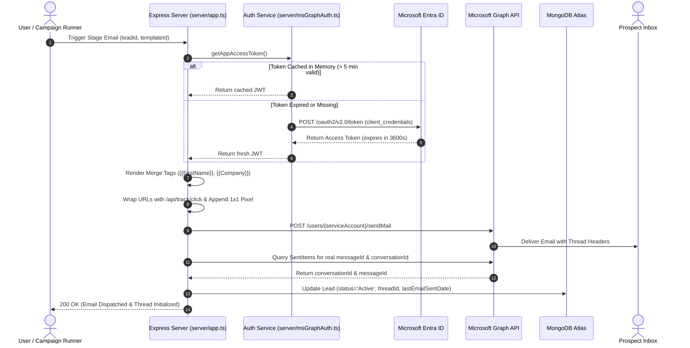
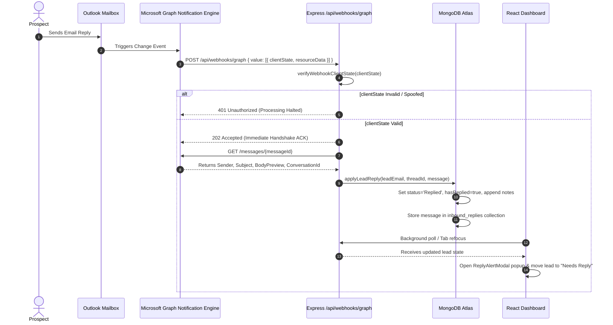

# GINI / Outreach Flow — Complete System Architecture & Operational Walkthrough

> **Document Version:** 2.0.0  
> **Target Audience:** Engineering Leads, Senior Architects, and Technical Stakeholders  
> **Application Name:** GINI / Outreach Flow  
> **Repository:** `Sahhitya-naresh/GINI`  
> **Last Updated:** September 2026  

---

## Table of Contents
1. [Executive Summary & High-Level Overview](#1-executive-summary--high-level-overview)
2. [End-to-End Technology Stack & Dependencies](#2-end-to-end-technology-stack--dependencies)
3. [System Architecture & Core Data Flows](#3-system-architecture--core-data-flows)
4. [Database Architecture & MongoDB Schemas](#4-database-architecture--mongodb-schemas)
5. [Microsoft 365 & Microsoft Graph API Integration](#5-microsoft-365--microsoft-graph-api-integration)
6. [Microsoft Graph Webhooks (Change Notifications)](#6-microsoft-graph-webhooks-change-notifications)
7. [Email Engagement Tracking Engine (Opens & Clicks)](#7-email-engagement-tracking-engine-opens--clicks)
8. [Visual Workflow Canvas & Sequence Execution Engine](#8-visual-workflow-canvas--sequence-execution-engine)
9. [Lead Lifecycle State Machine](#9-lead-lifecycle-state-machine)
10. [Frontend UI & Component Walkthrough](#10-frontend-ui--component-walkthrough)
11. [Background Jobs, Cron Schedules & Automation](#11-background-jobs-cron-schedules--automation)
12. [Security Boundary & Production Hardening](#12-security-boundary--production-hardening)
13. [Environment Configuration Reference](#13-environment-configuration-reference)
14. [Deployment, Local Development & Testing Guide](#14-deployment-local-development--testing-guide)

---

## 1. Executive Summary & High-Level Overview

**GINI (Outreach Flow)** is an enterprise cold-outreach automation platform and CRM designed to execute multi-stage, behavior-adaptive email campaigns. Unlike basic email blasters, GINI functions as a closed-loop system: it dispatches emails using dedicated Microsoft 365 corporate mailboxes, tracks prospect opens and link clicks in real time, visualizes workflows through a node-based flowchart canvas, and automatically halts outreach sequences the instant a prospect replies via Microsoft Graph Webhooks.

```
+-----------------------------------------------------------------------------------+
|                                  GINI PLATFORM                                    |
|                                                                                   |
|  +---------------------+      +------------------------+      +----------------+  |
|  |   React 19 Frontend | <--> | Express / Vercel API   | <--> | MongoDB Atlas  |  |
|  |   (Tailwind, Flow)  |      | (TypeScript Node.js)   |      | Single Source  |  |
|  +---------------------+      +------------------------+      +----------------+  |
|                                       ^          ^                                |
|                        OAuth App-Only |          | Webhook Push                   |
|                        Send & Read    |          | (Instant Reply)                |
|                                       v          v                                |
|                       +-----------------------------------+                       |
|                       |   Microsoft Graph API (Office 365)|                       |
|                       |   Enterprise Mailbox              |                       |
|                       +-----------------------------------+                       |
+-----------------------------------------------------------------------------------+
```

### Key Business & Technical Capabilities
1. **Application-Level Microsoft 365 Mailbox Automation**: Connects directly to Microsoft Entra ID (Azure AD) using OAuth 2.0 Client Credentials Grant. Emails are sent from genuine corporate mailboxes with SPF, DKIM, and DMARC alignment, ensuring highest deliverability.
2. **Instant Inbound Reply Detection via Webhooks**: Replaces resource-intensive cron polling with Microsoft Graph Change Notifications. When a lead replies, Microsoft pushes a webhook directly to the app, which transitions the lead to `"Replied"`, pauses the sequence, and triggers live UI alerts.
3. **Behavioral Branching Engine**: Uses a visual workflow builder (`@xyflow/react`) to define sequences that fork depending on whether a lead opened an email, clicked a specific URL, or replied.
4. **Single Source of Truth Database**: Powered by MongoDB Atlas (with in-memory dev fallback), maintaining strong typing, transaction support, and zero stale fixtures.
5. **Real-Time Engagement Tracking**: Tracks pixel opens and link redirects without third-party tracking cookies or external ad-tech dependencies.

---

## 2. End-to-End Technology Stack & Dependencies

### 2.1 Frontend Stack
* **React 19 (`react`, `react-dom` v19.0.1)**: Modern concurrent UI rendering with zero legacy class components.
* **Vite v6.2.3**: Ultra-fast module bundler with Hot Module Replacement (HMR).
* **TypeScript v5.8.2**: Strict type safety across all components, interfaces, and state objects.
* **Tailwind CSS v4.1.14 & Custom Design System**: Curated dark-mode aesthetic with slate/indigo glassmorphism tokens.
* **React Flow (`@xyflow/react` v12.11.6)**: Interactive nodal canvas for building visual campaign workflows with custom node handlers, minimap, controls, and edge routing.
* **Lucide React (`lucide-react` v0.546.0)**: Clean, high-clarity iconography.
* **Recharts (`recharts` v3.10.1)**: Responsive analytics charts (stage delivery funnel, conversion trends, open/click rate distributions).
* **Motion (`motion` v12.23.24)**: Hardware-accelerated micro-animations and modal transitions.
* **SheetJS (`xlsx` v0.18.5)**: Client-side parsing and validation for CSV/Excel prospect imports.

### 2.2 Backend & Serverless Runtime
* **Node.js (v20+ LTS)**: Server execution environment.
* **Express v4.21.2**: Robust REST API routing, webhook receivers, tracking redirects, and middleware handling.
* **esbuild v0.25.0**: Blazing fast production compiler packaging `server/api-entry.ts` into a lightweight serverless bundle at `api/index.js` for Vercel.
* **tsx v4.21.0**: Direct TypeScript execution for local development (`npm run dev`) and automated testing scripts.

### 2.3 Database & Storage
* **MongoDB Node.js Driver (`mongodb` v7.6.0)**: Native high-throughput driver utilizing connection pooling, read/write projection, and atomic updates.
* **MongoDB Atlas (Production)**: Cloud-hosted replica set with encryption at rest and automated backups.
* **MongoDB Memory Server (`mongodb-memory-server` v11.3.0)**: Zero-config, in-process MongoDB engine automatically spawned when developing offline or without an active internet connection.

### 2.4 External APIs & Identity
* **Microsoft Graph API (v1.0)**:
  - Mail sending: `POST /users/{serviceAccount}/sendMail`
  - Mail reading & thread sync: `GET /users/{serviceAccount}/messages`
  - Subscriptions API: `POST /subscriptions`, `PATCH /subscriptions/{id}`, `GET /subscriptions`
* **Microsoft Entra ID (Azure AD)**: OAuth 2.0 Token Endpoint (`https://login.microsoftonline.com/{tenantId}/oauth2/v2.0/token`) using client credentials (`client_id` + `client_secret`).
* **Google GenAI (`@google/genai` v2.4.0)**: Integrated for optional AI-assisted cold email subject/copy generation.

---

## 3. System Architecture & Core Data Flows

### 3.1 Outbound Email Dispatch & Threading Flow



### 3.2 Inbound Reply Detection Flow via Webhooks



---

## 4. Database Architecture & MongoDB Schemas

GINI uses MongoDB as its single source of truth. All data is structured across discrete collections with strict indexing on lookup keys (`leadId`, `email`, `threadId`, `campaignId`).

### 4.1 Collection Overview

| Collection Name | Purpose | Primary / Index Keys |
| :--- | :--- | :--- |
| `leads` | Core CRM table holding all prospect records, status, and metrics | `leadId` (unique), `email`, `threadId`, `status` |
| `campaigns` | Campaign definitions and serialized ReactFlow graph topologies | `id` (unique), `name`, `is_active` |
| `tasks` | Human-in-the-loop manual tasks generated by workflow branches | `id` (unique), `leadId`, `isCompleted` |
| `senders` | Multi-sender configurations, display names, and daily send limits | `id` (unique), `email` |
| `settings` | Global app configuration, stage gap rules, and branding metadata | `_id: 'app_settings'` |
| `trackingEvents`| Raw event log for every open pixel view and link click redirect | `id`, `leadId`, `type`, `timestamp` |
| `graph_subscriptions` | Active Microsoft Graph webhook subscription tokens and expiry timestamps | `id` (subscriptionId), `expirationDateTime` |
| `inbound_replies` | Full text, headers, and metadata of all prospect email replies | `id`, `leadEmail`, `threadId` |

### 4.2 Document Schemas

#### 1. `leads` Collection Document
```typescript
interface BackendLead {
  leadId: string;              // "LEAD-101"
  name: string;                // "Sarah Connor"
  firstName: string;           // "Sarah"
  lastName: string;            // "Connor"
  email: string;               // "sarah@cyberdyne.com"
  company: string;             // "Cyberdyne Systems"
  jobTitle: string;            // "Chief Technology Officer"
  industry: string;            // "Artificial Intelligence"
  linkedinUrl: string;         // "https://linkedin.com/in/sarah-connor"
  painPoint: string;           // "Legacy automated scaling bottlenecks"
  
  // Sequence & Workflow State
  status: 'Active' | 'Replied' | 'Paused' | 'Completed' | 'Broke Up';
  currentStage: number;        // Stage index (0 to 7)
  currentNodeId: string;       // ReactFlow node ID: "node-email-stage-2"
  campaignId: string;          // Associated campaign ID: "camp-01"
  campaign: string;            // Human-readable campaign name
  threadId: string;            // Microsoft Graph conversationId
  lastEmailSentDate: string;   // ISO timestamp
  nextSendDate: string;        // YYYY-MM-DD
  nodeEnteredDate: string;     // ISO timestamp when current node was reached
  senderUsed: string;          // Sender email utilized for dispatch
  notes: string;               // CRM notes & reply audit log
  
  // Engagement Metrics
  opensCount: number;          // Total open pixel loads
  firstOpenedDate?: string;    // First recorded open timestamp
  lastOpenedDate?: string;     // Most recent open timestamp
  clicksCount: number;         // Total tracked link clicks
  firstClickedDate?: string;   // First click timestamp
  lastClickedDate?: string;    // Most recent click timestamp
  
  // Reply Flags
  hasReplied?: boolean;        // Set to true upon webhook reply detection
  hasUnreadReply?: boolean;    // Set to true until SDR reviews the reply
  lastReplyReceivedDate?: string; // ISO timestamp of prospect reply
  
  createdAt: string;
  updatedAt: string;
}
```

#### 2. `campaigns` Collection Document
```typescript
interface BackendCampaign {
  id: string;                  // "camp-1727601234"
  name: string;                // "Enterprise Q4 SaaS Outreach"
  description?: string;        // "Outreach to VP of Engineering leads"
  is_active: boolean;          // Controls whether automated runner evaluates leads
  workflow_graph: {            // Serialized ReactFlow Canvas
    nodes: Array<{
      id: string;
      type: 'start' | 'email' | 'wait' | 'condition' | 'task' | 'merge';
      position: { x: number; y: number };
      data: Record<string, any>;
    }>;
    edges: Array<{
      id: string;
      source: string;
      target: string;
      sourceHandle?: string;   // e.g. "yes", "no" on conditions
      targetHandle?: string;
    }>;
  };
  createdAt: string;
  updatedAt: string;
}
```

#### 3. `graph_subscriptions` Collection Document
```typescript
interface GraphSubscriptionRecord {
  id: string;                  // Microsoft Graph subscription UUID
  subscriptionId: string;      // Mirror of ID
  resource: string;            // "users/{serviceAccount}/mailFolders('Inbox')/messages"
  changeType: string;          // "created"
  notificationUrl: string;     // "https://yourdomain.com/api/webhooks/graph"
  expirationDateTime: string;  // ISO timestamp (approx 2.93 days after creation)
  clientState: string;         // Secret hash verified on incoming POSTs
  createdAt: string;
  updatedAt: string;
}
```

---

## 5. Microsoft 365 & Microsoft Graph API Integration

GINI avoids fragile user-level OAuth prompts (which expire when tokens expire or passwords change) by implementing **Enterprise Application-Level (Client Credentials) Authentication** against Microsoft Entra ID.

### 5.1 Architecture & Permissions
The backend runs as a registered Enterprise Application in Azure AD with the following scoped Microsoft Graph Application Permissions:
* `Mail.Send`: Allows the server to dispatch stage emails directly through the corporate service mailbox.
* `Mail.Read` / `Mail.ReadWrite`: Allows the server to read conversation threads, fetch prospect reply bodies, and detect incoming responses.
* `Subscription.ReadWrite.All`: Allows the server to register and renew push notification webhooks on the mailbox.

### 5.2 Token Lifecycle & In-Memory Caching (`server/msGraphAuth.ts`)
To prevent making a new OAuth request for every email or API call, access tokens are cached in memory:
1. When `getAppAccessToken()` is called, it checks `cachedToken`.
2. If the token is valid for more than **5 minutes** into the future, the cached JWT is returned immediately.
3. If expiring or missing, a single concurrent promise fetches a new token from `https://login.microsoftonline.com/{tenantId}/oauth2/v2.0/token`.

### 5.3 RFC 2822 Conversation Threading
To ensure cold outreach emails appear in the prospect's email client as clean, continuous conversation threads rather than disjointed messages:
1. When sending Stage 1, Microsoft Graph assigns a unique `conversationId`.
2. GINI queries the `SentItems` folder immediately after dispatch to capture the true `conversationId` and `internetMessageId`.
3. For subsequent stages (Stage 2 through 7), GINI attaches threading headers:
   ```json
   "internetMessageHeaders": [
     { "name": "In-Reply-To", "value": "<previous-internet-message-id>" },
     { "name": "References", "value": "<previous-internet-message-id>" }
   ]
   ```
4. This groups all sequence follow-ups into a single native email thread in Outlook, Gmail, and Apple Mail.

---

## 6. Microsoft Graph Webhooks (Change Notifications)

Historically, outreach platforms polled email mailboxes every 5–15 minutes. This wasted CPU, hit API rate limits, and created long delays before an SDR noticed a lead's reply. GINI utilizes **Microsoft Graph Change Notifications (Webhooks)** for zero-latency, real-time reply handling.

### 6.1 Handshake Validation (Zero-Latency ACK)
When creating or validating a subscription, Microsoft Graph sends a request containing a query parameter:
`POST /api/webhooks/graph?validationToken={randomTokenString}`
Microsoft mandates that the server respond within **10 seconds** with:
* HTTP Status `200 OK`
* Header `Content-Type: text/plain; charset=utf-8`
* Exact plain text body containing the decoded token.

GINI's endpoint in [server/app.ts](file:///d:/outreach/GINI/server/app.ts#L930) handles this in under **5 milliseconds**.

### 6.2 The `clientState` Cryptographic Security Boundary
Anyone on the public internet could theoretically send fake POST requests to a webhook URL to falsely mark leads as "Replied" (which would silently stop their sales sequence). 

To prevent this, GINI enforces a strict security boundary:
1. When registering the webhook subscription with Microsoft Graph, GINI provides a cryptographically secure `clientState` secret (configured via `MICROSOFT_GRAPH_CLIENT_STATE`).
2. When Microsoft sends a real notification, it echoes back this exact `clientState` inside each change item.
3. GINI inspects every incoming notification in `req.body.value` using Node.js's native `crypto.timingSafeEqual`:
   ```typescript
   export function verifyWebhookClientState(provided: string, expected?: string): boolean {
     const secret = expected || getWebhookClientState();
     if (!provided || !secret) return false;
     const bufProvided = Buffer.from(provided);
     const bufSecret = Buffer.from(secret);
     if (bufProvided.length !== bufSecret.length) return false;
     return crypto.timingSafeEqual(bufProvided, bufSecret);
   }
   ```
4. If an attacker attempts to spoof the endpoint or sends an invalid `clientState`, GINI terminates the request with **HTTP 401 Unauthorized** before any database operations occur.

### 6.3 Automated Subscription Renewal & Daily Cron
Microsoft Graph enforces a strict maximum lifetime on mail folder subscriptions: **4,230 minutes (~2.93 days)**.

To ensure reply detection never lapses:
* GINI implements [renewExpiringGraphSubscriptions()](file:///d:/outreach/GINI/server/msGraphService.ts#L790) mounted at `/api/cron/renew-subscriptions`.
* It queries active subscriptions and identifies any expiring within 24 hours.
* It sends a `PATCH` request to Microsoft Graph to extend the expiration date by another 4,200 minutes.
* This is scheduled in [vercel.json](file:///d:/outreach/GINI/vercel.json#L4-L9) to run automatically every night at 02:00 UTC:
  ```json
  "crons": [
    {
      "path": "/api/cron/renew-subscriptions",
      "schedule": "0 2 * * *"
    }
  ]
  ```

---

## 7. Email Engagement Tracking Engine (Opens & Clicks)

GINI features a fully internal tracking engine that requires no third-party tracking services (such as SendGrid or Mailgun).

### 7.1 Open Tracking (Transparent 1x1 Pixel)
* When an email template is compiled, GINI injects a 1x1 pixel image tag before the closing `</body>` tag:
  ```html
  
  ```
* When the prospect opens the email, their email client requests this image.
* The endpoint `/api/track/open`:
  1. Immediately returns a binary 1x1 transparent GIF (`43 bytes`) with `Cache-Control: no-cache, no-store, must-revalidate`.
  2. Asynchronously logs an `open` event in the `trackingEvents` collection.
  3. Increments `opensCount` and updates `lastOpenedDate` on the corresponding `leads` record in MongoDB.

### 7.2 Link Click Tracking (Redirect Engine)
* GINI parses the email body HTML and wraps every hyperlink:
  - Original: `<a href="https://cyberdyne.com/demo">Book Demo</a>`
  - Wrapped: `<a href="https://yourdomain.com/api/track/click?url=https%3A%2F%2Fcyberdyne.com%2Fdemo&leadId=LEAD-101&stage=1">Book Demo</a>`
* When clicked:
  1. The server records a `click` event with the prospect's `leadId`, target URL, and `user-agent`.
  2. Increments `clicksCount` and updates `lastClickedDate` on the lead record.
  3. Issues an immediate HTTP `302 Found` redirection to the destination URL.

---

## 8. Visual Workflow Canvas & Sequence Execution Engine

Campaign sequences in GINI are constructed visually using a drag-and-drop flowchart builder powered by `@xyflow/react`.

```
[Start Node]
     |
     v
[Email Node: Stage 1 Intro]
     |
     v
[Wait Node: 3 Business Days]
     |
     v
[Condition Node: Opened Email?]
     |                         |
(Yes)|                     (No)|
     v                         v
[Email: Social Proof]     [Email: Quick Follow-up]
     |                         |
     +------------+------------+
                  |
                  v
       [Condition: Replied?]
                  |
              (No)|
                  v
       [Task: SDR LinkedIn Touch]
```

### 8.1 Node Types & Functionality
1. **Start Node**: Defines scheduling constraints for the campaign:
   - `allowedDays`: Allowed sending days (e.g., Monday through Friday).
   - `startHour` & `endHour`: Sending window (e.g., 09:00 to 17:00).
   - `timezone`: Campaign timezone alignment.
2. **Email Node**: Specifies the outreach message:
   - Associates with a template stage (1 through 7) or custom subject/body copy.
   - Interpolates merge tags (`{{FirstName}}`, `{{Company}}`, `{{JobTitle}}`, `{{PainPoint}}`).
   - Links outbound messages into the active conversation thread.
3. **Wait Node**: Pauses sequence progression:
   - Sets a delay duration (e.g., `3 business days` or `48 hours`).
   - The campaign runner computes `Date.now() - nodeEnteredDate` and halts progression until the duration has elapsed.
4. **Condition Node**: Branching logic evaluator:
   - Evaluates: `has_replied`, `email_opened`, `link_clicked`, or `has_linkedin_url`.
   - Offers distinct `yes` and `no` connection handles to fork the prospect journey.
5. **Task Node**: Human-in-the-loop task generator:
   - Generates actionable tasks for SDRs (e.g., "Send LinkedIn connection request", "Call prospect").
   - Populates the **Manual Tasks Queue** with priority flags and due dates.
6. **Merge Node**: Consolidates multiple workflow branches back into a single pipeline.

### 8.2 Campaign Runner Execution Loop (`server/runnerBackend.ts`)
The campaign runner executes batch sequences with strict safety rules:
1. **Active Campaign Filter**: Skips campaigns where `is_active: false`.
2. **Reply Check Priority**: Evaluates prospect replies before dispatching any email. If a reply exists, the lead is immediately set to `Replied` and halted.
3. **Sender Quota Enforcement**: Tracks total dispatches per sender against their `dailySendLimit`. If a limit is hit, remaining leads are deferred to prevent mailbox burning.
4. **Schedule Window Check**: Verifies that the current system time falls within the Start node's allowed days and hours.

---

## 9. Lead Lifecycle State Machine

A prospect in GINI moves through a deterministic state machine:

```
                  [Import / CSV]
                        |
                        v
                   (0: Pending)
                        |
            [Campaign Execution Begins]
                        |
                        v
                 +------------+
                 |   Active   | <------+ (Resumed by SDR)
                 +------------+        |
                   |    |    |         |
     Prospect      |    |    | SDR     |
     Replies       |    |    | Pauses  |
        |          |    |    +---------+
        v          |    v
+---------------+  |  +------------+
|    Replied    |  |  |   Paused   |
| (Needs Reply) |  |  +------------+
+---------------+  |
                   v Sequence Finishes
             +-----------+
             | Completed |
             +-----------+
```

### State Definitions
* **`Active`**: The lead is currently enrolled in a campaign. The campaign runner evaluates this lead and advances them through workflow nodes.
* **`Replied` (Needs Reply)**: **Outreach is frozen.** The prospect sent an inbound reply. The lead is placed into the priority "Needs Reply" tab and an alert toast/modal appears in the UI. No further automated emails are sent.
* **`Paused`**: Manually halted by the SDR. The runner bypasses this lead.
* **`Completed`**: The prospect reached the terminal node of the campaign without replying.
* **`Broke Up`**: The prospect received the final break-up email (Stage 7) with no response.

---

## 10. Frontend UI & Component Walkthrough

The user interface is designed with a dark, high-contrast visual system:

### 10.1 Primary Navigation Tabs
* **All Leads Tab (`#tab-leads`)**: The central CRM table showing all leads, searchable by name, company, email, or campaign. Includes status badges, engagement chips (opens/clicks), quick pause/resume toggles, and detail view triggers.
* **Needs Reply Tab (`#tab-replied`)**: The high-priority inbox showing leads that have replied. Displays incoming message snippets, received timestamps, and direct response actions.
* **Workflows Tab (`#tab-workflows`)**: The ReactFlow visual campaign canvas where SDRs build and edit campaigns, drag nodes, configure branching rules, and activate sequences.
* **Manual Tasks Tab (`#tab-tasks`)**: Task management dashboard showing human SDR actions generated by workflows (LinkedIn outreach, phone calls) with priority filters and completion checkboxes.
* **Templates Tab (`#tab-templates`)**: Stage 1–7 template editor with live merge tag preview and sender assignment.
* **Analytics Tab (`#tab-analytics`)**: Live KPI metrics showing total sent, open rates, click rates, reply rates, stage drop-off funnel, and recent event feeds.

### 10.2 Modals & Drawers
* **`LeadDetailModal`**: Slide-over drawer presenting the prospect's full profile, CRM notes, open/click history, and the live Microsoft Graph email conversation thread.
* **`ReplyAlertModal`**: Real-time modal that pops up whenever a prospect reply is detected, highlighting the lead's name, company, and message preview so SDRs can respond immediately.
* **`CampaignSchedulerModal`**: Controls live automated dispatching, previewing due leads and reporting progress.
* **`ImportLeadsModal`**: Drag-and-drop CSV and Excel importer with automatic column mapping, duplicate detection, and email validation.
* **`SettingsModal`**: Mailbox sender profile configuration, daily send limits, and white-label branding options.

---

## 11. Background Jobs, Cron Schedules & Automation

GINI runs four automated background processes:

| Job / Process | Trigger Mechanism | Frequency | Purpose |
| :--- | :--- | :--- | :--- |
| **Graph Webhook Receiver** | External HTTP POST from Microsoft | Instantaneous (Event-Driven) | Receives inbound reply notifications, validates `clientState`, marks leads as `Replied`, and pauses sequences. |
| **Subscription Renewal Cron** | Vercel Cron (`/api/cron/renew-subscriptions`) | Daily (`0 2 * * *`) | Renews Graph subscriptions nearing expiration so webhooks never lapse. |
| **Campaign Sequence Runner** | Manual trigger or Scheduled Runner (`/api/campaigns/run`) | Configurable / On-Demand | Evaluates lead progression, enforces sending hours, and dispatches due stage emails. |
| **UI Polling & Tab Focus** | Browser `visibilitychange` & 3-minute interval | Every 3 min (while tab active) | Checks for freshly replied leads, updates the "Needs Reply" count badge, and shows toasts. |

---

## 12. Security Boundary & Production Hardening

### 12.1 Webhook Authentication
* Unlike standard endpoints that require user session cookies, the webhook endpoint must accept connections from Microsoft Graph servers.
* Protection is achieved via `clientState` matching with **constant-time buffer comparison** (`crypto.timingSafeEqual`), making brute-force and timing attacks computationally infeasible.

### 12.2 Credential Protection
* Azure AD secrets (`MICROSOFT_GRAPH_CLIENT_SECRET`) and MongoDB connection strings are stored strictly as server-side environment variables and never exposed to the client bundle.
* `.env.example` provides sanitised placeholders; real keys are excluded via `.gitignore`.

### 12.3 Proxy & SSL Configuration
* `app.set('trust proxy', true)` enables correct client IP resolution behind Vercel and reverse proxies.
* All tracking and webhook endpoints enforce HTTPS in production.

---

## 13. Environment Configuration Reference

The following environment variables configure the system in `.env`:

```bash
# --- Server & Environment ---
PORT=3000
NODE_ENV=development
APP_URL=http://localhost:3000

# --- MongoDB Database ---
MONGODB_URI=mongodb+srv://<username>:<password>@cluster0.mongodb.net/outreach_flow?retryWrites=true&w=majority

# --- Microsoft Entra ID (Azure AD) Credentials ---
MICROSOFT_GRAPH_TENANT_ID=xxxxxxxx-xxxx-xxxx-xxxx-xxxxxxxxxxxx
MICROSOFT_GRAPH_CLIENT_ID=xxxxxxxx-xxxx-xxxx-xxxx-xxxxxxxxxxxx
MICROSOFT_GRAPH_CLIENT_SECRET=xxxxxxxxxxxxxxxxxxxxxxxxxxxxxxxxxxxx

# --- Mailbox Configuration ---
MICROSOFT_GRAPH_SERVICE_ACCOUNT=outreach@yourcompany.com
MICROSOFT_GRAPH_DISPLAY_NAME="Outreach Team"

# --- Webhook Security Boundary ---
MICROSOFT_GRAPH_CLIENT_STATE=your_random_high_entropy_secret_string_here

# --- Optional Security & AI ---
CRON_SECRET=your_vercel_cron_secret_here
GEMINI_API_KEY=AIzaSy...
```

---

## 14. Deployment, Local Development & Testing Guide

### 14.1 Local Development
1. Clone the repository and install dependencies:
   ```bash
   git clone https://github.com/Sahhitya-naresh/GINI.git
   cd GINI
   npm install
   ```
2. Configure `.env` using `.env.example` as a template.
3. Start the combined frontend and backend server:
   ```bash
   npm run dev
   ```
4. Access the application at `http://localhost:3000`.

### 14.2 Automated Verification Scripts
GINI includes dedicated test suites to verify functionality end-to-end:
* **Verify Webhooks & Renewal**:
  ```bash
  npx tsx scripts/verify-graph-webhook.ts
  ```
  *Tests validation handshake, spoofed clientState rejection, real webhook status updates, and renewal crons.*
* **Verify Tracking Engine**:
  ```bash
  npx tsx scripts/verify-item6-analytics.ts
  ```
  *Tests 1x1 pixel loads, click redirects, and analytics aggregation.*
* **Verify Full UI & Reply Flow (Headless Browser)**:
  ```bash
  npx tsx scripts/verify-reply-flow.ts
  ```
  *Automates browser navigation, lead row verification, and toast display.*

### 14.3 Production Deployment (Vercel)
1. Build the production client and serverless API bundle:
   ```bash
   npm run build
   ```
2. The frontend is bundled to `dist/` and the serverless backend is bundled to `api/index.js`.
3. Push to `main` branch to trigger Vercel deployment.
4. Set the environment variables in the Vercel Project Settings.
5. Vercel automatically detects `vercel.json` and registers the daily `/api/cron/renew-subscriptions` cron job.

---

*Authored and certified for production readiness by the Antigravity Engineering Agent.*
